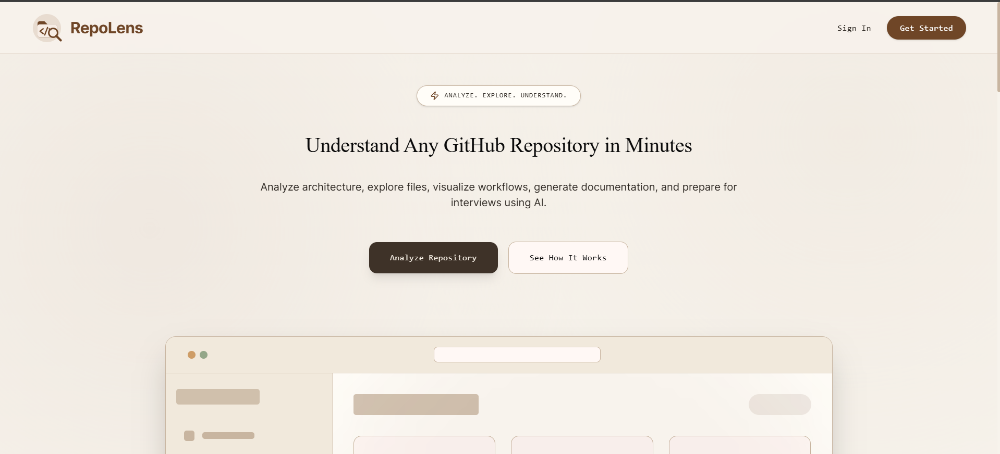
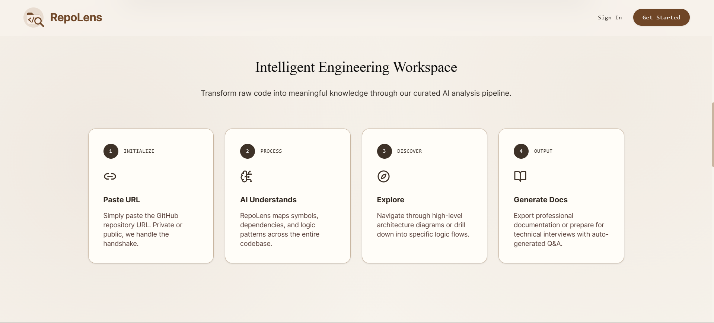
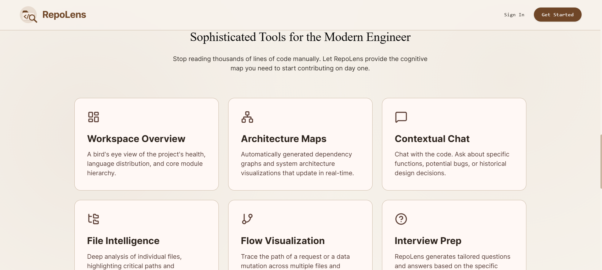
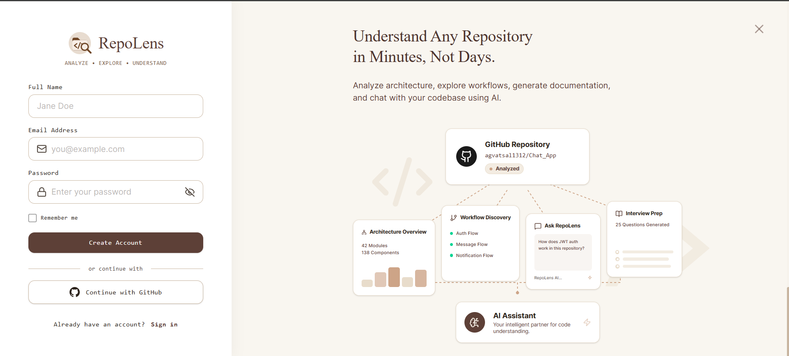
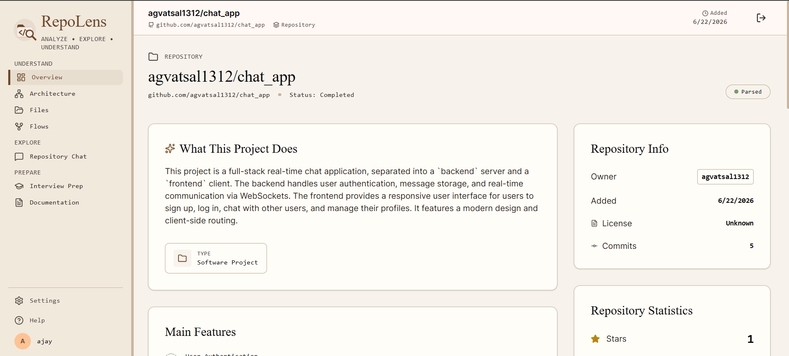
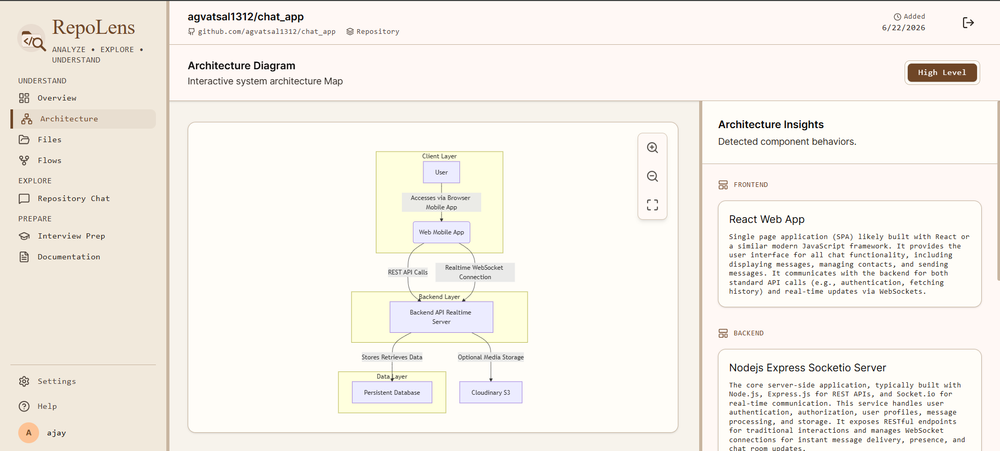
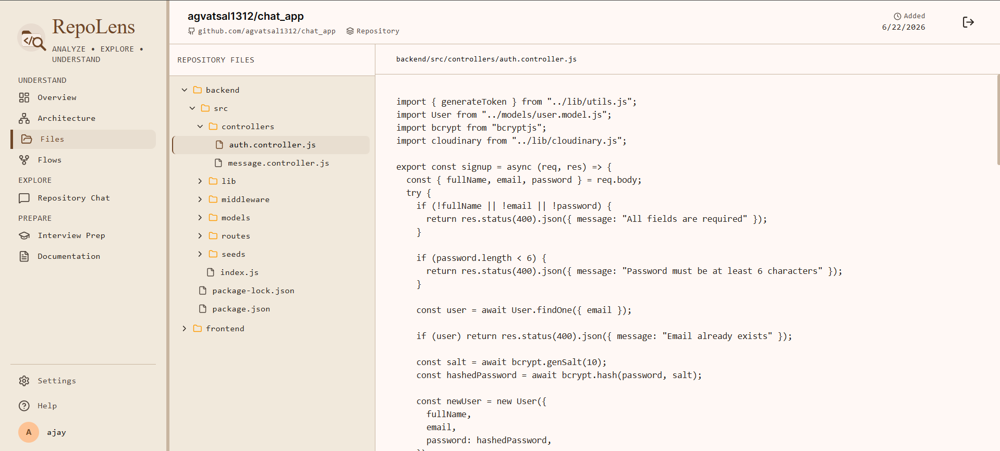
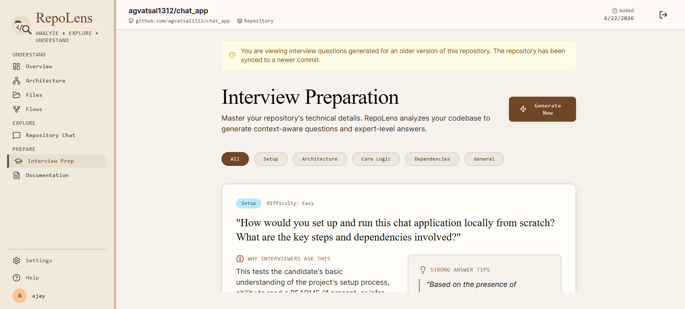

<div align="center">


# RepoLens

### *Analyze. Explore. Understand.*

[](https://repolens-wm5i.onrender.com)
[](https://www.typescriptlang.org/)
[](https://react.dev/)
[](https://deepmind.google/technologies/gemini/)
[](https://qdrant.tech/)
[](https://www.mongodb.com/)
[](LICENSE)

<br/>

**Built by [Vatsal Agarwal](https://github.com/agvatsal1312)**

</div>

---



> **RepoLens is an AI-powered codebase intelligence platform.** Paste any public GitHub URL and walk away with a full architectural breakdown, an interactive AI assistant that knows your code, auto-generated documentation, query-driven visual flow diagrams, and a bespoke interview prep guide — all driven by semantic vector search and Gemini 2.5 Flash.

---

## Table of Contents

- [What Is RepoLens?](#-what-is-repolens)
- [How It Works](#-how-it-works)
- [Features](#-features)
  - [Authentication & Onboarding](#-authentication--onboarding)
  - [Dashboard & Repository Management](#-dashboard--repository-management)
  - [Overview — Repository Intelligence](#-overview--repository-intelligence-at-a-glance)
  - [Architecture — Interactive System Diagram](#-architecture--interactive-system-diagram)
  - [Files — Full Repository Explorer](#-files--full-repository-file-explorer)
  - [Flows — Query-Driven Process Visualization](#-flows--query-driven-process-visualization)
  - [Repository Chat — RAG-Powered Q&A](#-repository-chat--rag-powered-codebase-qa)
  - [Interview Prep](#-interview-prep--repository-specific-qa)
  - [Documentation](#-documentation--auto-generated-technical-docs)
  - [Auto-Sync](#-auto-sync--always-up-to-date)
- [The UX Psychology — Perceived Performance](#-the-ux-psychology--perceived-performance)
- [System Architecture](#-system-architecture)
- [Security Architecture](#-security-architecture)
- [Resilience & Graceful Degradation](#-resilience--graceful-degradation)
- [Tech Stack](#-tech-stack)
- [Getting Started](#-getting-started)
- [Project Structure](#-project-structure)
- [Contributing](#-contributing)
- [Author](#-author)
- [License](#-license)

---

## ✦ What Is RepoLens?

Most developers understand codebases they wrote. Very few truly understand codebases they *inherited*. RepoLens bridges that gap.

When you submit a GitHub repository URL, RepoLens silently orchestrates a multi-stage pipeline: it shallow-clones the repo, parses every supported source file, chunks and embeds the content into a Qdrant vector database using Gemini's `gemini-embedding-2-preview` model, and then uses `Gemini 2.5 Flash` to synthesize intelligent, repository-aware outputs across seven distinct views — Overview, Architecture, Files, Flows, Chat, Interview Prep, and Documentation.

The result is not just a summary. It is a **living, queryable understanding of the codebase** — one that stays in sync with every new commit pushed to GitHub.

---

## ✦ How It Works



The pipeline breaks down into four phases:

**1 — Initialize.** Paste a GitHub URL. RepoLens validates the repository exists via the GitHub API and fetches the latest commit hash before any work begins.

**2 — Process.** The server shallow-clones the repo (`git clone --depth 1`), walks every supported source file, and embeds each file into Qdrant using Gemini's embedding model. Dependencies, logic patterns, and symbols are all captured semantically at 768 dimensions.

**3 — Discover.** Navigate interactive architecture diagrams, generate query-driven flow diagrams, or browse the full file tree with syntax highlighting.

**4 — Output.** Export professional technical documentation or prepare for a technical interview using auto-generated, repository-specific Q&A — all grounded in the actual code.

---

## ✦ Features



---

## ✦ Authentication & Onboarding



RepoLens supports two authentication pathways, both surfaced from a single clean auth screen with an animated value-proposition panel on the right.

### Email / Password Registration

Standard credential-based auth with full server-side validation via Zod schemas, bcrypt password hashing (10 salt rounds), and JWT tokens (7-day expiry). Tokens are stored in `localStorage` (persistent) or `sessionStorage` (session-only) based on the **"Remember me"** checkbox state — a small but meaningful distinction that respects user intent.

### Continue with GitHub (OAuth 2.0)

A complete server-side GitHub OAuth 2.0 flow:

1. Clicking **"Continue with GitHub"** redirects to GitHub's authorization page with the app's `client_id`.
2. GitHub redirects back to `/api/auth/github/callback` with a short-lived authorization `code`.
3. The server exchanges the code for an access token using the `client_secret` — **the secret never touches the client browser at any point**.
4. A JWT is minted for the user and forwarded to the frontend via a URL query parameter (`?token=...`), which the app reads, stores, and immediately strips from the URL via `window.history.replaceState` — no token lingers in browser history.
5. On subsequent logins, the same GitHub account is recognized by `githubId` and merged — no duplicate accounts are ever created.

The right panel of the auth screen features a live animated diagram of what RepoLens produces — Architecture Overview, Workflow Discovery, the Ask RepoLens chat, and Interview Prep — setting clear expectations before the user has even logged in.

---

## ✦ Dashboard & Repository Management

The dashboard is the command center for all your analyzed repositories. Every card shows real-time status indicators, detected language, GitHub stats (stars, forks, license), and the date it was added.

### Adding a Repository

Paste any valid public GitHub URL into the input field. The client validates the URL format before submission. On submit, the server:

1. Validates the repo exists via the GitHub API
2. Fetches the latest commit hash
3. Acquires a distributed lock (Redis `SET NX PX`, in-memory fallback) on the normalized URL to prevent concurrent duplicate jobs
4. Creates the repository record with `status: pending`
5. Immediately navigates the user to the real-time `ProgressView`

### Repository Status Lifecycle

Each repository card reflects one of these states:

| Status | What It Means |
|--------|--------------|
| `pending` | Queued, about to start |
| `cloning` | Shallow git clone in progress |
| `parsing` | Source files being parsed and embedded into Qdrant |
| `syncing` | New commit detected; running surgical diff-only update |
| `completed` | Fully analyzed, all views available |
| `failed` | Pipeline errored; clicking the card auto-retries from scratch |

### Processing Progress View

Once submitted, a real-time progress screen polls `/api/repositories/:id` every 2 seconds and renders an animated stepper that reflects the current pipeline stage:

```
○ Initializing
○ Cloning Repository
● Parsing & Embedding Source Code   ← animated ring = current step
○ Completed
```

On completion the view auto-transitions to Overview after a brief celebration pause. On failure, the error message stored in `errorMessage` is surfaced clearly with an option to retry.

### Safe Repository Deletion

Deleting a repository requires typing the full `owner/name` string into a confirmation input — a deliberate friction mechanism that prevents accidental deletion. On confirmed delete, all associated data is removed: the MongoDB repository document, all `RepositoryFile` records, chat history, saved flows, interview prep, documentation versions, and every Qdrant vector belonging to that repo.

---

## ✦ Overview — Repository Intelligence at a Glance



The Overview is the first destination after analysis completes. It is not a README regurgitation — it is a Gemini-synthesized intelligence report built from the actual source files, `package.json`, and README of the repository.

### What's on the Overview page

**What This Project Does** — A plain-language description of the repository's purpose, synthesized and clarified from the source, not just copied from the README.

**Main Features** — A bulleted list of discrete features detected in the codebase, from both documented behavior and inferred functionality.

**Tech Stack** — Language and framework badges detected from `package.json`, dependency files, and file extensions.

**Folder Structure Summary** — A folder-by-folder breakdown explaining what each top-level directory contains and its role in the system. Invaluable for large monorepos where the directory layout tells most of the architectural story.

**Repository Info Panel** — Shows `owner`, `Added` date, `License` (sourced from the GitHub API), and `Commits` count (fetched live on every visit — always current).

**Repository Statistics** — Stars and forks pulled live from the GitHub API at page load, not stale stored values. The UI compares live commit count against the stored commit hash and surfaces a sync banner if a new commit has been pushed since the last analysis.

### Live Sync Detection

Every time the Overview loads, RepoLens silently queries the GitHub API for the current commit count and compares it against what was analyzed. If the repository has moved ahead, a subtle banner appears informing the user and offering a one-click re-sync — triggering the efficient diff-only update pipeline rather than a full re-clone.

---

## ✦ Architecture — Interactive System Diagram



The Architecture view generates a **Mermaid.js system architecture diagram** directly from the repository's structure.

### What makes it distinct

- **Interactive** — pan and zoom via `react-zoom-pan-pinch`; a fullscreen toggle expands the diagram to fill the viewport
- **Freshly generated** — Gemini analyzes the complete file tree and infers the layered structure (Client, Backend, Database, External Services) from directory names, file types, and import patterns
- **Layered Insights panel** — the right panel lists every detected architectural layer (Frontend, Backend, Database, etc.) with a component title and explanatory prose for each
- **Hardened Mermaid syntax** — the generation prompt enforces strict diagram rules: no parentheses in node labels, no `activate`/`deactivate` in non-sequence diagrams, unique subgraph IDs, purely alphanumeric node identifiers, and standard `A -->|Label| B` relationship syntax — constraints derived from real-world Mermaid parsing failures during development

A **"High Level"** toggle in the top-right allows switching between a detailed and a simplified diagram view.

---

## ✦ Files — Full Repository File Explorer



The Files view gives you a complete file tree browser of the analyzed repository, rendered from the parsed `RepositoryFile` documents stored in MongoDB.

### Features

**Collapsible directory tree** — every folder expands and collapses with a single click; deeply nested structures are fully navigable without pagination.

**File content viewer** — clicking any file loads its full content into a syntax-highlighted panel on the right using `react-syntax-highlighter` with the VSCode Dark+ theme.

**File path breadcrumb** — the currently open file's full path is shown in the top bar (e.g., `backend/src/controllers/auth.controller.js`).

**External link** — the top bar provides a direct link to the repository on GitHub for quick cross-reference with the live source.

The content panel loads the full raw file as stored during parsing — a faithful snapshot of the codebase at the analyzed commit, not a truncated preview.

---

## ✦ Flows — Query-Driven Process Visualization

The Flows view answers the question developers most often ask about an unfamiliar codebase: *"What actually happens when X occurs?"*

### How a flow is generated

1. You type a natural language query — *"How does user authentication work?"* or *"What happens when a message is sent?"*
2. RepoLens embeds the query using Gemini and runs a vector search over the repository's Qdrant collection, retrieving the 15 most semantically relevant code chunks
3. Gemini receives the retrieved code as context and generates a **Mermaid sequence diagram or flowchart** with a step-by-step prose explanation grounded in the actual code paths

### Multiple flows per repository

Flows are **saved and persisted**. A sidebar lists every previously generated flow for the current repository. You can:

- Generate as many flows as you want, each on a different topic or code path
- Switch between saved flows instantly with no re-generation cost
- Start a new flow from the `+` button without losing the current one

### Smart deduplication via intent-matching

Before triggering a new Gemini generation, the system checks if an existing saved flow semantically matches your query. If it does, a floating toast notification appears — *"Found an existing flow matching your intent: 'Auth Flow'"* — and navigates you to the existing result rather than duplicating it. This prevents Gemini quota waste and keeps the saved flows list clean.

### Toast notification system

The Flows view uses an animated floating toast for non-blocking feedback — deduplication notices, generation errors, and semantic match confirmations appear at the top of the screen and auto-dismiss after 4 seconds, never interrupting the user's interaction with the diagram.

---

## ✦ Repository Chat — RAG-Powered Codebase Q&A

The Chat view is a full conversational interface grounded **exclusively in the analyzed repository's codebase** — not a general-purpose chatbot, but a context-aware assistant that only knows what is in the code.

### The RAG pipeline

```
User message
     ↓
  Embed query (gemini-embedding-2-preview, RETRIEVAL_QUERY)
     ↓
  Qdrant cosine search — top 10 chunks, filtered to this repo
     ↓
  Assemble context block with file path annotations
     ↓
  Gemini prompt: "Answer ONLY from context. Cite source files."
     ↓
  Stream response token-by-token → client
     ↓
  Source file citations in every response
```

### One session per repo per user

Each user has a **single persistent chat thread per repository**, scoped by `userId + repositoryId` in MongoDB. Every return visit restores the full conversation history exactly as it was left.

### Intelligent history summarization cascade

As conversations grow long, older messages are automatically summarized to prevent context window overflow. The summarization tries three tiers in sequence:

| Tier | Model | Purpose |
|------|-------|---------|
| 1 | Groq — llama3-8b-8192 | Fastest, free; used first |
| 2 | HuggingFace — Mistral-7B-Instruct | Fallback if Groq unavailable |
| 3 | Gemini 2.5 Flash | Final guarantee |

The summary preserves all technical details and established context so the conversation remains coherent even across hundreds of exchanges.

---

## ✦ Interview Prep — Repository-Specific Q&A



Interview Prep generates 10–15 technical interview questions **specific to the analyzed repository** — not generic language questions, but questions about *this codebase's* architecture, design decisions, and technology choices.

### Question card anatomy

Each card contains:

- **Category tag** — Architecture, Core Logic, Dependencies, Setup, or General
- **Difficulty badge** — Easy, Medium, or Hard  
- **The question** — phrased exactly as an interviewer would ask it
- **"Why Interviewers Ask This"** — the underlying concept or competency being probed
- **Strong Answer Tips** — key talking points and code references pulled from the actual repository

### Category filter

A pill-based filter bar lets you narrow by category. Clicking "Architecture" shows only architectural questions; "Core Logic" surfaces implementation-focused ones. "All" resets the filter.

### Shared across users — version-locked per commit

Interview questions are generated **once per commit hash** and shared across all users of the same repository. If Alice generates interview prep for commit `abc123` of a repository, Bob sees the same questions when he visits — he doesn't wait for a new generation. The questions are identical for study groups and team onboarding without extra cost.

The artificial **6-second delay** when serving cached results is intentional UX — see [The UX Psychology](#-the-ux-psychology--perceived-performance) section below.

### Version awareness and toggle

When a repository syncs to a new commit, new interview prep can be generated for the updated codebase. Both versions are preserved indefinitely. A commit-version selector at the top of the page lets you switch between any versioned question set.

When viewing questions from an older commit, a yellow information banner reads: *"You are viewing interview questions generated for an older version of this repository. The repository has been synced to a newer commit."* — with a **Generate New** button to create fresh questions for the current version.

---

## ✦ Documentation — Auto-Generated Technical Docs

The Docs view generates three comprehensive markdown documents directly from the source code. Each document is professional-grade and immediately usable.

### Three documents, one generation

**README.md** — Project overview, value propositions, prerequisites, step-by-step installation, environment variable documentation, and usage examples — ready to drop into any repository.

**ARCHITECTURE.md** — A thorough architectural document covering component descriptions, data flow, layer responsibilities, state management approach, and the key design decisions present in the codebase.

**API_REFERENCE.md** — Deep-dive reference for all REST endpoints or internal module APIs, including method signatures, parameter descriptions, return values, error handling behavior, and edge cases.

### Document viewer features

- **Tab switching** — jump between the three documents with a click; each tab tracks its own scroll position
- **Table of Contents sidebar** — auto-extracted from markdown headings (H1–H4), rendered as a nested TOC with anchor links for quick in-document navigation
- **Syntax-highlighted code blocks** — all code samples in generated markdown render with VSCode Dark+ highlighting via `react-syntax-highlighter`
- **Copy button** — copies raw markdown to clipboard in one click
- **Download button** — downloads the active document as a `.md` file, ready to commit

### Version-locked, shared, and cached

Exactly like Interview Prep, documentation is generated per commit hash and shared across all users. The same 6-second perceived-effort delay applies for cached results. Old versions are preserved, new ones can be generated after a sync, and a version selector with informational banners communicates clearly which commit's documentation you are viewing.

---

## ✦ Auto-Sync — Always Up to Date

RepoLens tracks the `latestCommitHash` of every analyzed repository. The sync mechanism ensures the platform stays accurate without ever doing an expensive full re-clone after the initial analysis.

### How sync works

1. When you revisit a repository or re-submit its URL, the server fetches the current HEAD commit hash from the GitHub API
2. If the hash differs from the stored value, `status` is set to `syncing` and a background diff job begins immediately
3. The frontend shows a **toast notification** informing the user that a sync is in progress — graceful, non-blocking, honest
4. The server calls the GitHub Compare API to get only the changed files (`added`, `modified`, `removed`, `renamed`)
5. Only affected files are re-parsed and re-embedded — new and modified files are upserted into Qdrant; removed files are deleted from both MongoDB and Qdrant
6. `latestCommitHash` is updated to the new value and `status` returns to `completed`

A 500-line change across 3 files syncs in seconds. The rest of the analyzed codebase is untouched.

### Stale content banners

After a sync, Interview Prep and Documentation pages that were generated for the previous commit display a clear yellow banner informing the user that the current content was generated for an older version, with a direct call-to-action to generate fresh output for the new commit.

---

## ✦ The UX Psychology — Perceived Performance

RepoLens deliberately introduces a **6-second artificial delay** when serving cached Interview Prep and Documentation results from the database.

This is not a bug or an oversight. It is an intentional product design decision grounded in UX research.

When users request generation, they are mentally expecting the system to *think*. A cached database result returned in 200ms creates cognitive dissonance — users question whether real AI was involved, doubt the quality of the output, and feel that something was skipped. The delay:

- Aligns the user's perception of effort with the quality of the output they receive
- Makes cached and freshly-generated responses feel identical — consistent across all users
- Prevents the experience from feeling "too fast to be credible"
- Maintains the expectation that RepoLens is doing meaningful work, because it is — the work was just done earlier and stored

This is a well-studied pattern: **perceived effort correlates strongly with perceived quality**. The delay is the system respecting the user's mental model of what AI-powered generation should feel like.

---

## ✦ System Architecture

```
┌─────────────────────────────────────────────────────────────┐
│                        React 19 SPA                         │
│  Dashboard · Overview · Architecture · Chat · Files         │
│  Flows · Interview Prep · Docs · Settings                   │
└─────────────────────────┬───────────────────────────────────┘
                          │ REST API  (JWT Bearer)
┌─────────────────────────▼───────────────────────────────────┐
│                  Express.js Server (Node)                    │
│  ┌──────────────┐  ┌──────────────┐  ┌──────────────────┐  │
│  │  Auth Routes │  │  Repo Routes │  │  Security Layer  │  │
│  │  JWT + bcrypt│  │  Analyze /   │  │  Helmet · Rate   │  │
│  │  GitHub OAuth│  │  Chat / Flows│  │  Limit · XSS ·   │  │
│  └──────────────┘  │  Docs / etc  │  │  Mongo Sanitize  │  │
│                    └──────┬───────┘  └──────────────────┘  │
└───────────────────────────┼─────────────────────────────────┘
                            │
         ┌──────────────────┼──────────────────────┐
         │                  │                      │
┌────────▼──────┐  ┌────────▼────────┐  ┌──────────▼──────────┐
│   MongoDB     │  │    Qdrant       │  │  Gemini 2.5 Flash   │
│   (Atlas)     │  │  Vector DB      │  │  + Embedding 2.0    │
│               │  │                 │  │                     │
│  Repositories │  │  768-dim        │  │  Summarization      │
│  Files        │  │  Cosine Sim.    │  │  Architecture       │
│  Chat History │  │  Per-repo       │  │  Chat / Flows       │
│  Flows        │  │  filtered       │  │  Interview Prep     │
│  Interview    │  │  search         │  │  Documentation      │
│  Docs         │  └─────────────────┘  └─────────────────────┘
└───────────────┘
         │
┌────────▼──────┐  ┌─────────────────┐  ┌────────────────────┐
│   Redis       │  │  Groq API       │  │  HuggingFace API   │
│  (Upstash)    │  │  llama3-8b-8192 │  │  Mistral-7B        │
│               │  │  Summarizer #1  │  │  Summarizer #2     │
│  Distributed  │  └─────────────────┘  └────────────────────┘
│  Locking +    │
│  In-memory    │
│  fallback     │
└───────────────┘
```

### The Repository Processing Pipeline in Detail

**Step 1 — Validation & Lock Acquisition**
Before any work begins, the server fetches the latest commit hash from the GitHub API to confirm the repository exists and is accessible. A distributed lock is then acquired using Redis `SET NX PX` (atomic set-if-not-exists with expiry) on the normalized URL. This prevents two concurrent requests from spinning up duplicate analysis jobs for the same repository. If Redis is unreachable, an in-memory lock map provides identical semantics for single-instance deployments.

**Step 2 — Clone or Diff**
For a **new repository**, the server performs `git clone --depth 1` — a shallow clone that fetches only the latest commit tree, keeping disk usage minimal and clone time fast. For a **known repository where the commit hash has changed**, the server instead hits the GitHub Compare API to retrieve only the diff: which files were added, modified, removed, or renamed. Only those files are re-processed. For a **failed repository**, all state is reset and the full clone is retried.

**Step 3 — Parsing & Embedding**
The server walks the cloned directory recursively, processing every supported file type: `.js`, `.jsx`, `.ts`, `.tsx`, `.py`, `.html`, `.css`, `.json`, `.md`, `.txt`, `.yml`, `.yaml`, `.dart`, `.java`, `.kt`, `.swift`, `.c`, `.cpp`, `.h`, `.go`, `.rb`, `.php`, `.rs`, `.sql`, `.sh`, and more. Files over 1MB are skipped. Each file's content (up to 5,000 characters) is embedded using `gemini-embedding-2-preview` with `RETRIEVAL_DOCUMENT` task type at 768 dimensions, then upserted into Qdrant under the `repolens_chunks` collection — indexed by `repoId` and `filePath` for fast filtered retrieval.

**Step 4 — AI Summarization**
Gemini 2.5 Flash receives the README, `package.json`, and the full file path listing to generate the structured Overview: project description, feature list, tech stack breakdown, folder summaries, and statistics. All generation calls have a 3-retry loop with exponential backoff (2s → 4s → 6s) specifically handling 503 overload responses.

---

## ✦ Security Architecture

RepoLens is built with defence-in-depth — every layer of the stack has explicit security controls:

| Layer | Implementation |
|-------|----------------|
| **HTTP Security Headers** | `helmet` — XSS protection, MIME sniffing prevention, referrer policy, clickjacking protection via X-Frame-Options |
| **Rate Limiting** | `express-rate-limit`: 500 requests / 15-minute window per IP; `trust proxy: 1` for accurate IP detection behind Render's reverse proxy |
| **Input Validation** | `zod` schemas validate all request bodies — register, login, and analyze URL all have strict shape requirements |
| **XSS Protection** | `xss-clean` middleware strips malicious HTML/script tags from all incoming request data |
| **NoSQL Injection** | `express-mongo-sanitize` removes MongoDB operator characters (`$`, `.`) from all request bodies and query params |
| **Authentication** | JWT (HS256), 7-day expiry; `bcryptjs` with 10 salt rounds for all stored passwords |
| **GitHub OAuth** | Authorization code exchanged for access token server-side only; `client_secret` is never sent to or accessible by the browser |
| **Distributed Locking** | Redis `SET NX` (atomic) prevents concurrent duplicate repository analysis jobs; in-memory fallback for Redis-unavailable environments |
| **Body Size Limit** | `express.json({ limit: '10mb' })` prevents payload-size-based denial-of-service |
| **Token Storage** | JWT stored in `localStorage` (remember me) or `sessionStorage` (session only) — never in cookies, eliminating CSRF surface |

---

## ✦ Resilience & Graceful Degradation

RepoLens is engineered to survive partial infrastructure failure without crashing or producing silent incorrect behavior:

**Redis unavailable** — If Redis is unreachable at startup or disconnects mid-session, the locking layer automatically falls back to an in-memory `Map`-based lock. All locking semantics (prevent duplicate jobs, atomic acquire/release) continue working for single-instance deployments. The error is silently absorbed to prevent log pollution on environments where Redis is intentionally absent.

**Qdrant collection missing** — `initQdrant()` runs on every server start. If the `repolens_chunks` collection does not exist (new deployment, data reset, or accidental deletion), it is automatically created with the correct 768-dimensional cosine distance configuration and `repoId`/`filePath` payload indexes. If a "Not Found" error occurs during a vector delete (collection was dropped externally), the collection is silently re-initialized rather than crashing the sync job.

**Gemini 503 overload** — All `generateContent` and `generateContentStream` calls wrap the Gemini SDK in a retry loop that specifically handles 503 service-unavailable responses with exponential backoff: 2s, 4s, 6s, up to 3 attempts. 503s are common under high AI API load and are always transient.

**Gemini rate limit on embedding (429)** — 429 errors during the per-file embedding phase are caught individually per file. The affected file is logged as skipped and the pipeline continues processing the remaining files. A partially-embedded repository is still useful — the skipped files remain in MongoDB and are accessible via the file explorer.

**LLM summarization cascade failure** — If Groq fails, HuggingFace is tried. If HuggingFace fails, Gemini handles it. The cascade guarantees that chat history summarization always has a reachable model regardless of individual API availability or quota exhaustion.

**MongoDB not configured** — If `MONGO_URI` is absent from the environment, the server logs a clear diagnostic message and continues starting. All database-dependent operations return structured 500 errors rather than crashing the process — useful for local development environments without a database connection.

---

## ✦ Tech Stack

### Backend

| Technology | Role |
|------------|------|
| Node.js + TypeScript | Runtime; compiled with `tsx` (dev), `esbuild` (production bundle) |
| Express.js 4 | HTTP server, middleware chain, routing |
| MongoDB + Mongoose 9 | Primary data store (Atlas) |
| Qdrant Cloud | Vector database — 768-dim cosine similarity search |
| Google Gemini 2.5 Flash | LLM for all generation tasks |
| Gemini Embedding 2.0 Preview | Semantic embeddings at 768 dimensions |
| Redis via ioredis (Upstash) | Distributed locking; in-memory fallback |
| JWT + bcryptjs | Authentication and password hashing |
| simple-git | Shallow repository cloning |
| Zod | Runtime request body validation |
| Helmet | HTTP security headers |
| express-rate-limit | Per-IP rate limiting |
| xss-clean | Input XSS sanitization |
| express-mongo-sanitize | NoSQL injection prevention |
| Groq API (llama3-8b-8192) | Tier-1 chat history summarizer |
| HuggingFace (Mistral-7B-Instruct) | Tier-2 chat history summarizer |

### Frontend

| Technology | Role |
|------------|------|
| React 19 | UI framework |
| TypeScript | End-to-end type safety |
| Vite 6 | Build tool and dev server with HMR |
| Tailwind CSS v4 | Utility-first styling |
| Mermaid.js 11 | Architecture and flow diagram rendering |
| react-zoom-pan-pinch | Interactive diagram pan and zoom |
| react-markdown + rehype-slug | Markdown rendering with heading anchors |
| react-syntax-highlighter | Code block syntax highlighting (VSCode Dark+) |
| Motion (Framer Motion) | Page and component animations |
| Lucide React | Icon system |

---

## ✦ Getting Started

### Prerequisites

- Node.js 20+
- MongoDB Atlas account (free tier sufficient)
- Qdrant Cloud account (free tier sufficient)
- Google AI Studio API key
- Redis / Upstash account (optional — in-memory fallback used if absent)

### Installation

```bash
# Clone the repository
git clone https://github.com/agvatsal1312/RepoLens.git
cd RepoLens

# Install dependencies
npm install

# Copy environment template
cp .env.example .env
```

### Environment Variables

```env
# ── Database ──────────────────────────────────────────
MONGO_URI=mongodb+srv://<user>:<pass>@cluster.mongodb.net/repolens

# ── Auth ──────────────────────────────────────────────
JWT_SECRET=a_long_random_secret_string_minimum_32_chars

# ── AI ────────────────────────────────────────────────
GEMINI_API_KEY=your_google_ai_studio_key

# ── Vector DB ─────────────────────────────────────────
QDRANT_URL=https://your-instance.cloud.qdrant.io
QDRANT_API_KEY=your_qdrant_api_key

# ── Cache / Locking (optional) ────────────────────────
# Falls back to in-memory locking if not provided
REDIS_URL=redis://default:<pass>@your-upstash-host:6379

# ── GitHub OAuth (optional) ───────────────────────────
GITHUB_CLIENT_ID=your_github_oauth_app_client_id
GITHUB_CLIENT_SECRET=your_github_oauth_app_client_secret

# ── GitHub API rate limit (optional) ─────────────────
# Raises limit from 60 req/hr (unauthenticated) to 5,000 req/hr
GITHUB_TOKEN=your_personal_access_token

# ── LLM Summarization Fallbacks (optional) ───────────
GROQ_API_KEY_1=your_groq_api_key
HUGGINGFACE_API_KEY_1=your_huggingface_api_key
```

### Running Locally

```bash
# Development — Vite HMR frontend + Express backend on :3000
npm run dev

# Production build
npm run build

# Serve production build
npm start
```

---

## ✦ Project Structure

```
RepoLens/
├── server.ts                           # Express entry: security middleware, DB init, routes
├── src/
│   ├── App.tsx                         # Root: routing state machine, resizable sidebar
│   ├── types.ts                        # Shared TypeScript interfaces
│   ├── index.css                       # Global styles, CSS custom properties
│   ├── components/
│   │   ├── AuthView.tsx                # Login / Register / GitHub OAuth + animated panel
│   │   ├── DashboardView.tsx           # Repo list, URL input, status cards, delete modal
│   │   ├── ProgressView.tsx            # Animated stepper, 2s polling, auto-transition
│   │   ├── OverviewView.tsx            # Summary, tech stack, features, live GitHub stats
│   │   ├── ArchitectureView.tsx        # Mermaid diagram + layer insights + pan/zoom
│   │   ├── ChatView.tsx                # Streaming RAG chat, history restore, citations
│   │   ├── FilesView.tsx               # Collapsible file tree + syntax-highlighted viewer
│   │   ├── FlowsView.tsx               # Saved flows sidebar, query input, Mermaid render
│   │   ├── InterviewPrepView.tsx       # Q&A cards, category filter, version toggle
│   │   ├── DocsView.tsx                # Three-doc viewer, TOC, copy/download, version toggle
│   │   ├── SettingsView.tsx            # User profile management
│   │   ├── Sidebar.tsx                 # Resizable nav (UNDERSTAND / EXPLORE / PREPARE)
│   │   ├── TopBar.tsx                  # Repo header, GitHub link, navigation
│   │   ├── Mermaid.tsx                 # Mermaid.js renderer with error boundary
│   │   ├── EmptyState.tsx              # Reusable empty/loading placeholder
│   │   └── LogoSVG.tsx                 # SVG logo component
│   └── server/
│       ├── redis.ts                    # Redis client, SET NX locking, in-memory fallback
│       ├── routes/
│       │   ├── auth.ts                 # /api/auth/* route definitions
│       │   └── repositories.ts         # /api/repositories/* route definitions
│       ├── controllers/
│       │   ├── auth.ts                 # register, login, profile, deleteAccount, GitHub OAuth
│       │   ├── repositories.ts         # analyze, list, get, delete, sync
│       │   ├── chat.ts                 # RAG chat message + history retrieval
│       │   ├── flows.ts                # Flow generation + saved flow list
│       │   ├── architecture.ts         # Architecture diagram generation
│       │   ├── documentation.ts        # Docs generation + version management
│       │   ├── interview.ts            # Interview prep generation + version management
│       │   └── files.ts                # File tree + file content retrieval
│       ├── services/
│       │   ├── repository.service.ts   # Full pipeline: clone, diff-sync, parse, embed, summarize
│       │   ├── embedding.service.ts    # Gemini embed + Qdrant upsert per file
│       │   ├── chat.service.ts         # RAG query pipeline + three-tier history summarization
│       │   ├── flow.service.ts         # Vector search → Mermaid flow generation
│       │   ├── architecture.service.ts # File tree → architecture diagram + insights
│       │   ├── documentation.service.ts# Full codebase → 3 professional markdown documents
│       │   ├── interview.service.ts    # README + structure → interview Q&A generation
│       │   └── qdrant.service.ts       # Client init, collection creation, payload indexes
│       ├── models/
│       │   ├── Repository.ts           # Status, commits, summaries, interview[], docs[]
│       │   ├── RepositoryFile.ts       # File path, content, size, language
│       │   ├── RepositoryFlow.ts       # Saved Mermaid flows per repository
│       │   ├── ChatMessage.ts          # Chat history: userId + repositoryId + messages[]
│       │   ├── User.ts                 # name, email, passwordHash, githubId
│       │   └── UserRepoTracker.ts      # Per-user repo access + lastSeenCommitHash
│       └── utils/
│           └── gemini.util.ts          # generateContent + generateContentStream + retry logic
└── public/
    ├── logo.png
    ├── screenshot_landing.png
    ├── screenshot_auth.png
    ├── screenshot_howitworks.png
    ├── screenshot_features.png
    ├── screenshot_overview.png
    ├── screenshot_architecture.png
    ├── screenshot_files.png
    └── screenshot_interview.png
```

---

## ✦ API Reference

All routes except auth registration and login require a `Bearer <token>` header.

### Auth — `/api/auth`

| Method | Endpoint | Description |
|--------|----------|-------------|
| `POST` | `/register` | Register with name, email, password |
| `POST` | `/login` | Login, returns JWT |
| `GET` | `/profile` | Get authenticated user profile |
| `DELETE` | `/account` | Delete account and all associated data |
| `GET` | `/github` | Initiate GitHub OAuth flow |
| `GET` | `/github/callback` | GitHub OAuth callback — redirects with token |

### Repositories — `/api/repositories`

| Method | Endpoint | Description |
|--------|----------|-------------|
| `POST` | `/analyze` | Submit a GitHub URL for analysis |
| `GET` | `/` | List all repositories for the current user |
| `GET` | `/:id` | Get a single repository (accepts `?ack=true`) |
| `DELETE` | `/:id` | Remove repository and all associated data |
| `GET` | `/:id/files` | Get the full file tree |
| `GET` | `/:id/files/:fileId` | Get a single file's content |
| `POST` | `/:id/chat` | Send a chat message (RAG) |
| `GET` | `/:id/chat` | Get full chat history |
| `POST` | `/:id/flows` | Generate a flow diagram for a query |
| `GET` | `/:id/flows` | List all saved flows |
| `GET` | `/:id/architecture` | Get or generate the architecture diagram |
| `GET` | `/:id/interview` | Get or generate interview prep (supports `?check=true`) |
| `GET` | `/:id/docs` | Get or generate documentation (supports `?check=true`) |

---

## ✦ Contributing

Pull requests are welcome. For significant changes, please open an issue first to discuss the proposal.

```bash
# Type-check the entire project
npm run lint

# Verify the production build compiles cleanly
npm run build
```

Please keep pull requests focused on a single concern and include a clear description of what was changed and why.

---

## ✦ Author

**Vatsal Agarwal**

[](https://github.com/agvatsal1312)

---

## ✦ License

This project is licensed under the **MIT License** — see the [LICENSE](LICENSE) file for details.

---

<div align="center">

Built with Gemini · Qdrant · MongoDB · Redis · React · Express

*RepoLens — because every codebase deserves to be understood.*

</div>
